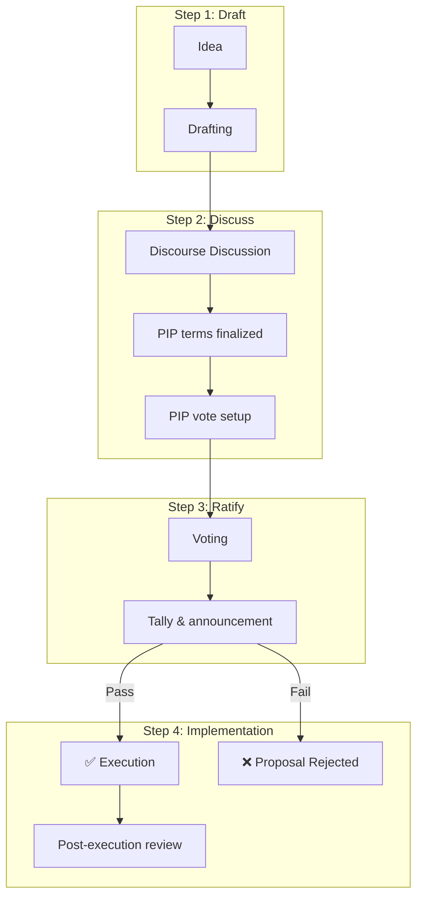

# Protocol Improvement Proposals (PIP)

NodeOps Network governance relies on Protocol Improvement Proposals (PIPs).

This [repo](https://github.com/NodeOps-app/pips.git) is the single source of truth for such proposals.

This file details how to create and vote on a PIP.

| Table of contents               |
|---------------------------------|
| [Overview](#overview)            |
| [Voting weights](#voting-weights) |
| [Administration tasks](#to-be-determined) |
| [How to submit a PIP](#how-to-submit-a-pip) |
| [Step 1: Draft](#step-1-draft)  |
| [Step 2: Discuss](#step-2-discuss) |
| [Step 3: Ratify](#step-3-ratify) |
| [Step 4: Implement the vote](#step-4-implement-the-vote) |
| [PIP statuses](#pip-status)        |
| [PIP proposal schema](#pip-proposal-schema) |
| [PIP template](#template-schema) |


## Voting weights

Both general and specialized participants are represented in governance according to their stake and network responsibilities. Votes may be cast according to the following participation classes:

1. Standard participation: staked and bonded $NODE tokens carry equal voting weight (1 token = 1 vote).

2. Universal Node Orchestrator (UNO) Operator participation: Each UNO operator receives a voting weight of 2,000 $NODE tokens for every UNO NFT they hold.

> The increased weight reflects the UNO operators’ specialized role in network verification and monitoring.

## Overview

The PIP process enables community members to propose on, and enact change on, the NodeOps Network Protocol. 

## To be determined

It is likely that several adminstrative roles will need to be created to facilitate the PIP flow. These roles will be defined, and eligible candidates selected, by this PIP process. Until this is completed, NodeOps core contributors will execute as required.

## How to submit a PIP

### Step 1: Draft

A PIP starts as a **draft**. This may be a nascent idea brought for discussion with the community on [Discourse](https://nodeops.discourse.group/), it may be a fully formed [PIP brought as a merge request](#submit-a-pip) to this repository that is then presented [to the community](https://nodeops.discourse.group/).



### Step 2: Discuss

The next step is for the PIP proponents to engage in discussion with the community. Community members who wish to comment on the PIP should do so in the [Discourse](https://nodeops.discourse.group/) channel.

> Don't split the discussion between this GitHub and Discourse.

Typically, a 7-10 day discussion is encouraged.

The PIP is developed and refined in discussion with the community, changes may be made to the PR or a new PR created. 

At the completion of the discussion phase, a final version of the fully-defined PIP is submitted as a Pull Request to this repository.

#### Submit a PIP

1. Fork the repo.
2. Add your PIP definition file and assign it the next available PIP identifier.
3. Make a PR from the fork to https://github.com/NodeOps-app/pips.git.

<details>
  <summary>Click for details on making a PR</summary>
  
1. [Fork this repository](https://github.com/NodeOps-app/pips/fork).

> You may use the GitHub "Fork" button top-right.
> After you have forked the repository, either work from the [GitHub UI](https://docs.github.com/en/repositories/working-with-files/managing-files/editing-files) or [clone](https://docs.github.com/en/repositories/creating-and-managing-repositories/cloning-a-repository) your fork (not the original) to create a local copy on your computer. This allows you to make changes locally and push them to your fork on GitHub.

2. Add your file and assign it the next available PIP identifier.

> If PIP-008 is the previous PIP either on main or in the existing PR set, then increment the identifier to PIP-009.

3. Submit your change as a pull request from your fork to the upstream repository. 

> Within a reasonable timeframe after you've submitted your PR, a repo maintainer will review your pull request.

</details>

> The repo maintainers will provide feedback. The scope of the feedback is limited to ensuring that the PIP complies with the [PIP template's](#template-schema) format and structure (for example that the PIP has been assigned a unique number to identify it) and that the PIP is eligible for consideration (for example, applies to Protocol parameters that are within NodeOps Network's control).

> Maintainers will not offer commentary on a PIP's substance. Such feedback is conducted on [Discourse](https://nodeops.discourse.group/).

### Step 3: Ratify

Should a PIP that's lodged on the main branch of this repository pass the community temperature check on [Discourse](https://nodeops.discourse.group/), then a vote can be initiated.

Voting occurs in [https://portal.nodeops.network](https://portal.nodeops.network/). This requires an onchain vote to be setup for eligible community members to vote on a PIP, identified by its unique number/ PIP identifier. 

The PIP defines its own [voting window](#7-voting-window), typically between 3-21 days.The vote will be tallied and the results announced.

### Step 4: Implement the vote

If the PIP failed to receive enough votes, the PIP's status will be updated to **rejected**.

> If quorum was not reached, the PIP is considered to be rejected.

If the PIP received sufficient **For** votes, the PIP's status will be updated to **approved**.

Once the PIP is executed on and finalized at a Protocol level, its status will be updated to **deployed**. The GitHub issues in this repo can be used to track and report on any challenges or blockers to deployment.

## PIP status

A PIP may exist in one of these exclusive states:

- Draft
> Applied to PIPs submitted to this repo but not yet under discussion on Discourse.
- Discussion
> Applied to PIPs submitted to this repo and under discussion on Discourse.
- Approved
> Applied to PIPs that received sufficient **For** votes.
- Deployed
> Applied to approved PIPs that have been executed and finalized.
- Rejected
Applied to PIPs that failed to receive sufficient **For** votes or achieve voting quorum.
- Stale
> Applied to PIPs submitted to this repo that didn't progress to discussion, or didn't receive sufficient support from the community to progress to voting.

## PIP proposal schema

## NodeOps DAO proposal style & structure guide

A [NodeOps DAO](/Tokenomics/governance) proposal is made up of 7 sections as detailed below.

## 0. Metadata 

This holds the PIP's status. Use **Draft** or **Discussion** when first submitting a PIP according to where it is in the flow.

## 1. Proposal title

- Format: PIP-XX: Provide a short, clear description.
- Style: Sentence case with only key words capitalized; avoid overly technical jargon.
- Example: PIP-01: Establish quorum is functional

## 2. Summary

A concise statement outlining the proposal’s purpose and what it aims to achieve.

## 3. Longer description

A detailed explanation of the proposal, including context, background, rationale, and any relevant data or references. Clearly state the problem, the proposed solution, and why it matters for the NodeOps ecosystem.

## 4. Next steps

List the concrete actions or outcomes if the proposal is approved or rejected.

Format:

- If passed, (describe the action or change).
- If rejected, (describe alternative or next steps).

## 5. Voting options

Clearly state the 3 required voting choices: 

- For
- Against
- Abstain

## 6. Discussion link

Provide a link to the relevant Discourse discussion thread for community input.

## 7. Voting window

Set the window over which voting is possible, typically between 3 and 21 days.

### Template schema

```markdown

metadata: status

Title: PIP-XX: (Short, clear description)

Summary

(One or two sentences summarizing the proposal’s intent.)

Longer Description

(Detailed rationale, context, and supporting information. Explain the problem, solution, and expected impact.)

Next Steps

- If this resolution passes, (describe the resulting action).
- If this resolution fails, (describe what will happen next).

Voting Options

- For
- Against
- Abstain

Discussion Link

(Insert forum post link).

Voting window

(Start time:date stamp to end time:date stamp inclusive).

```

### Tips

- Use clear, accessible language
- Keep sections brief but informative
- Link to any supporting documents or references as needed